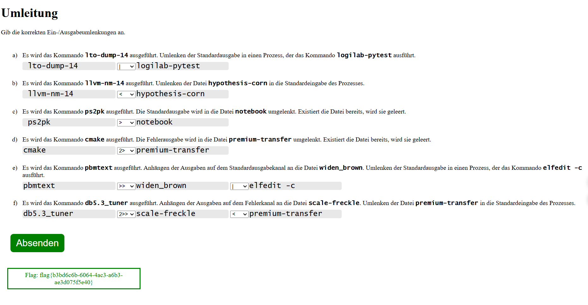
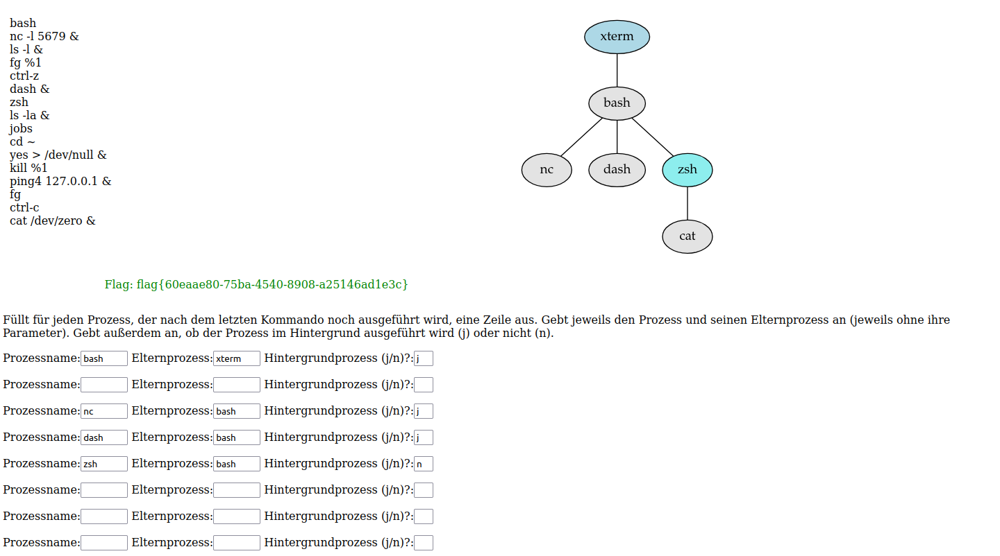
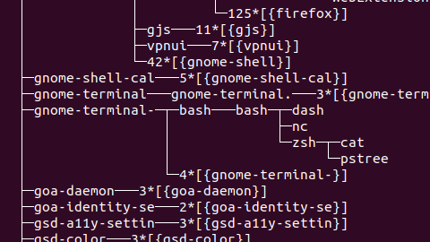

# Aufgabe 1

{width=100%}.

a) Ausgabe soll direkt Eingabe des nächsten Kommandos sein → Pipe
b) STDIN umleiten (<)
c) STDOUT überschreiben (>)
d) STDERR Fehlerkanal = 2>
e) Zuerst anhängen an Datei (>>), danach Pipe für Prozess
f) STDERR anhängen (2>>) + STDIN umleiten (<)

# Aufgabe 2

{width=100%}.

Um die Aufgabe vernünftig zu lösen ist es das einfachste, wenn man die entsprechenden Befehle direkt selbst im Terminal eingibt. Nachdem man dies erfolgreich getan hat, kann man mit dem Befehl "*pstree*" den Prozessbaum einsehen:

{width=100%}.

Um zu wissen, welche Prozesse im Vordergrund ausgeführt werden und welche im Hintergrund ausgeführt werden, muss man sich den Befehlen *fg* und *bg* (Vordergrund und Hintergrund) bewusst sein, außerdem ist zu beachten, dass, wenn ein Befehl mit "*&*" am Ende gestartet wird, dieser Befehl im Hintergrund ausgeführt wird. Wenn in einer Shell wie "bash" eine neue Shell "zsh" ausgeührt wird, dann wird die alte Shell zum Hintergrundprozess und die neue zum Vordergrundprozess. 

# Aufgabe 3

## Literaturverzeichnis
1) OpenAI ChatGPT Chatverlauf (s. Anhang) (04.11.2025)
2) Woyciechowski, Marcus (2020), Linux Cheat Sheet / Spickzettel: Übersicht der wichtigsten Terminal Befehle, in: woytec.de, 13.06.2020, https://woytec.de/linux/linux-cheat-sheet-spickzettel-uebersicht-der-wichtigsten-terminal-befehle/

# Anhang

Chatverlauf mit [ChatGPT] (https://chat.openai.com/chat) am 04.11.2025:
Frage: Zeig mir alle Ein-/Ausgabeumlenkungen

| Operator | Beschreibung                                                                               |
| -------- | ------------------------------------------------------------------------------------------ |
| `>`      | Standardausgabe (stdout) **in Datei schreiben** – Datei wird **neu angelegt oder geleert** |
| `>>`     | Standardausgabe **an Datei anhängen**                                                      |
| `<`      | Datei als **Standardeingabe (stdin)** verwenden                                            |
| `<<`     | **Here-Document**: mehrere Zeilen als Eingabe im Skript                                    |
| `<<<`    | **Here-String**: Zeichenkette als Eingabe                                                  |

| Operator | Beschreibung                                                              |
| -------- | ------------------------------------------------------------------------- |
| `2>`     | Standardfehler (stderr) in Datei schreiben – Datei **wird überschrieben** |
| `2>>`    | Standardfehler an Datei **anhängen**                                      |
| `&>`     | stdout und stderr zusammen in eine Datei (überschreiben)                  |
| `&>>`    | stdout und stderr **anhängen**                                            |
| `2>&1`   | stderr auf stdout umleiten (oder umgekehrt)                               |
| `1>&2`   | stdout auf stderr umleiten                                                |

| Beispiel          | Beschreibung                            |
| ----------------- | --------------------------------------- |
| `cmd >out 2>err`  | stdout in `out`, stderr in `err`        |
| `cmd >file 2>&1`  | stdout **und** stderr in dieselbe Datei |
| `cmd >>file 2>&1` | anhängen an dieselbe Datei              |

| Operator        | Beschreibung                                 |
| --------------- | -------------------------------------------- |
| `cmd1           | cmd2`                                        | 
| `cmd1 \|& cmd2` | stdout **und** stderr per Pipe an `cmd2`     |                                                      
| `cmd <(cmd2)`   | **Process substitution** – Eingabe wie Datei |                                                      
| `cmd >(cmd2)`   | Ausgabe wie Datei weiterleiten               |                                                    

| Beispiel          | Beschreibung                |
| ----------------- | --------------------------- |
| `cmd 2>/dev/null` | Fehlerausgabe **verwerfen** |
| `cmd 1>&-`        | stdout **schließen**        |
| `cmd 2>&-`        | stderr **schließen**        |

